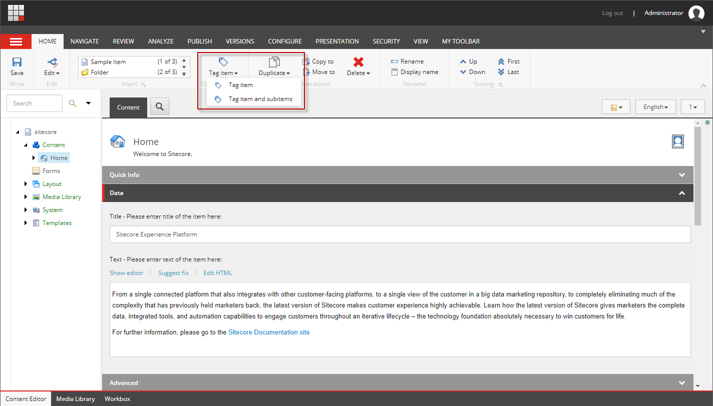
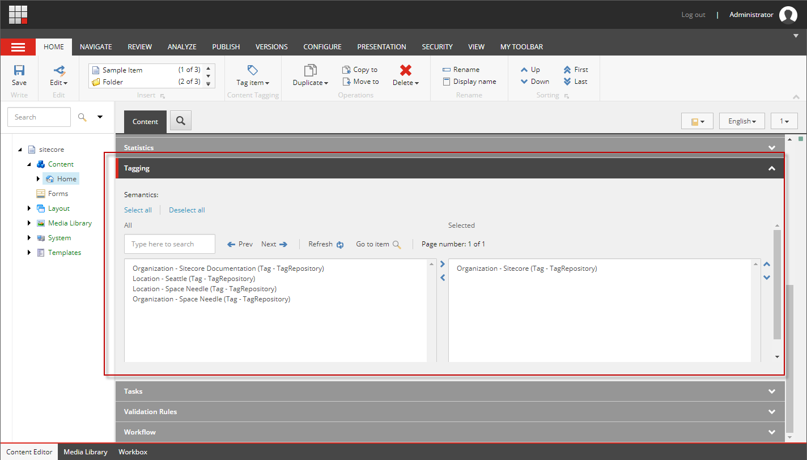
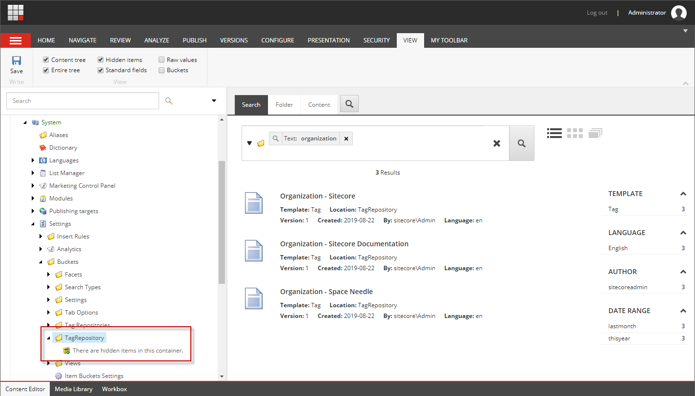

# Sitecore Cortex Content Tagging with Azure Cognitive Services Text Analytics Named Entities

Sitecore 9.1+ includes the ability to tag content.  This feature is called: [Sitecore Cortex Content Tagging](https://doc.sitecore.com/users/92/sitecore-experience-platform/en/tag-content-using-sitecore-cortex-content-tagging.html).  Items in Sitecore can be tagged based on content from configured fields.  Content Administrators tag content by navigating to the item they want to tag and selecting **Tag item** in the Home ribbon.



You can tag the item or tag the item with subitems.

> Note: Content tagging is only enabled if the content tagging provider is configured.

Once the tagging is complete, the tags appear in the **Tagging** section of the item.



The tags can then be used for various purposes on the site.

The tags are stored under `/sitecore/system/Settings/Buckets/TagRepository` in an item bucket.



If you are interested in storing the tags directly in an organized content tree, there is the [Custom Tagger Module](https://smartsitecore.com/en/building-custom-cortex-content-tagging/) created during the [Sitecore Hackathon 2019](http://www.sitecorehackathon.org/) by [Tomasz Juranek](https://twitter.com/tjWhuu), [Robert Debowski](https://twitter.com/robert_debowski), and [Rafal Dolzynski](https://www.linkedin.com/in/rafa%C5%82-do%C5%82%C5%BCy%C5%84ski-b4a2389b/).

## Content Tagging Provider

Sitecore Cortex Content Tagging is very pluggable.  It is implemented using pipelines. Each pipeline step can be replaced with a custom implementation.  [Here](https://doc.sitecore.com/developers/92/sitecore-experience-management/en/sitecore-cortex-content-tagging-architecture.html) is a good overview of the architecture. Out-of-the-box, Open Calais is [configured](https://doc.sitecore.com/developers/92/sitecore-experience-management/en/configure-open-calais-as-your-content-tagging-provider.html) as the content tagging provider.

*Open Calais analyzes the semantic content of input content using a combination of statistical, machine-learning, and custom pattern-based methods. The algorithms developed by the Text Metadata Services (TMS) group at Thomson Reuters output highly accurate and detailed metadata.* For more detailed information, see the official [Open Calais documentation FAQ](http://www.opencalais.com/open-calais-faq/).

### Azure Cognitive Services Text Analytics Named Entities

As mentioned above, the content tagging provider can be replaced.  We had a requirement to use **Azure Cognitive Services**.  Azure Cognitive Services supports **Named Entity Recognition** as part of the [Text Analytics Cognitive Service](https://azure.microsoft.com/en-us/services/cognitive-services/text-analytics/).  This module implements the **Azure Cognitive Services Named Entity Recognition** for the content tagging provider.

Named Entity Recognition: *Detect all named entities in the text, such as organizations, people, and locations, and more. Entity Linking disambiguates distinct entities by associating text to additional information on the web. For example, use it to determine whether a term such as “times” refers to “The New York Times” or “Times Square.”*  For more detailed information, see the official [page](https://azure.microsoft.com/en-us/services/cognitive-services/text-analytics/).

This module can be used as and example for creating your own Content Tagging Provider, or this module can be installed into Sitecore as is.

# Implementation

The existing Open Calais Discovery Provider needs to be replaced with a custom implementation supporting the Azure Cognitive Services Named Entity Recognition. 

First we create a class that implements `MessageSource` and `IDiscoveryProvider`.  We will name the class `AzureCognitiveServicesTextAnalyticsNamedEntitiesDiscoveryProvider`.  `GetTags` and `IsConfigured` needs to be implemented.

* `GetTags`: Perform content processing. Returns the list of discovered tags for the passed content.
* `IsConfigured`: Validate provider is configured. Tells Sitecore to enable the **Tag Item** ribbon button if the provider has been configured.

```csharp
public interface IDiscoveryProvider
{
    IEnumerable<TagData> GetTags(IEnumerable<TaggableContent> content);
    bool IsConfigured();
}
```

Microsoft provides a client API to use with their cloud service.  The NuGet package is: [Microsoft.Azure.CognitiveServices.Language.TextAnalytics](https://www.nuget.org/packages/Microsoft.Azure.CognitiveServices.Language.TextAnalytics/). This API makes it much easier to work with Azure Cognitive Services Text Analytics.  We will use the API to retrieve the named entities from the taggable content.

To prevent a lot of noise, we filter out any named entities not important for the implementation.  Logic has been added to filter out named entities in a configurable exclusion list.  Also, only entities with the type of Organization, Location, Other, and Quantity are kept.  Entities of type Other and Quantity have to specifically be included via configuration.

In addition to filtering the named entities, we want to normalize the incoming named entities.  Many variations of a named entity may exist, when we only want to keep one.  For example, "U.S.", "US", and "United States" are the same.  Instead of tagging items with different variations, we only want to tag with "United States". Configurable rules have been added to help with normalization.

The complete implementation of the `AzureCognitiveServicesTextAnalyticsNamedEntitiesDiscoveryProvider` class is located [here](https://bitbucket.org/onenorth/cortex-poc/src/master/src/OneNorth.SitecoreTextAnalytics/ContentTagging/Providers/AzureCognitiveServicesTextAnalyticsNamedEntitiesDiscoveryProvider.cs).


# Installation

There are 3 ways to install the Text Analytics package.  The first is via .update package.  This approach allows installing directly into an environment. Using this approach, the files are not tracked in version control.  The second way is to install into Visual Studio via NuGet packages.  This allows adding the module to version control. The third way is to manually copy the code into your project so it can be customized.

### Via Update Package
Download the latest Text Analytics module `.update` package from GitHub: https://github.com/onenorth/sitecore-text-analytics/releases

Install the module using the Update Installation Wizard: ```/sitecore/admin/UpdateInstallationWizard.aspx```.

### Via NuGet
Nuget packages can be found in GitHub: https://github.com/onenorth/sitecore-text-analytics/releases. Install the following NuGet packages.  You will need to host these packages: https://docs.microsoft.com/en-us/nuget/hosting-packages/overview

* Install `OneNorth.SitecoreTextAnalytics` into the `Website` project

### Via Code Copy
1. Clone or download the Text Analytics repository https://github.com/onenorth/sitecore-text-analytics/ into a location where you can copy the project structure.
1. Copy folder `OneNorth.SitecoreTextAnalytics` into your projects `src` folder. It should be a sibling of the Website project.
1. Open your project in Visual Studio and add the "OneNorth.SitecoreTextAnalytics" project to your solution, also add a reference to this project from the website solution.
1. You may need to update the target framework on the `OneNorth.SitecoreTextAnalytics` project to match the `Website` project. If this is required, you will also need to open up the NuGet package manager for the solution and sync up the package versions.
1. Copy the folder `\OneNorth.SitecoreTextAnalytics\App_config\Include\` into `\Website\App_config\Include\` in your project.


# Configuration

The module needs to be configured.  The configuration file is located at: `App_config\Include\OneNorth.SitecoreTextAnalytics.config`

Here is an example of the configuration for the `AzureCognitiveServicesTextAnalyticsNamedEntitiesDiscoveryProvider` provider.

```xml
<?xml version="1.0" encoding="utf-8" ?>
<configuration xmlns:patch="http://www.sitecore.net/xmlconfig/" xmlns:role="http://www.sitecore.net/xmlconfig/role/">
  <sitecore role:require="Standalone or ContentManagement">
    <settings>
      <!-- For testing, you can register for a free 7-day trial here: https://azure.microsoft.com/en-us/services/cognitive-services/text-analytics/ -->
      <setting name="AzureCognitiveServicesTextAnalytics.Endpoint" value="https://westcentralus.api.cognitive.microsoft.com" />
      <setting name="AzureCognitiveServicesTextAnalytics.Key" value="" />
      <setting name="AzureCognitiveServicesTextAnalytics.NamedEntities.IncludeOther" value="Advertising|Investment|Telecommunication" />
      <setting name="AzureCognitiveServicesTextAnalytics.NamedEntities.IncludeQuantity" value="401|529" />
      <setting name="AzureCognitiveServicesTextAnalytics.NamedEntities.Exclude" value="United States|America|U.S.|Company|Office|US" />
    </settings>
    <contentTagging>
      <configurations>
        <config name="Default">
          <discovery>
            <provider name="AzureCognitiveServicesTextAnalyticsNamedEntitiesDiscoveryProvider"/>
          </discovery>
        </config>
      </configurations>
      <providers>
        <discovery>
          <add name="AzureCognitiveServicesTextAnalyticsNamedEntitiesDiscoveryProvider" type="OneNorth.SitecoreTextAnalytics.ContentTagging.Providers.AzureCognitiveServicesTextAnalyticsNamedEntitiesDiscoveryProvider, OneNorth.SitecoreTextAnalytics" />
        </discovery>
      </providers>
      <fieldMap>
        <fieldNames>
          <field fieldName="Title">
            <patch:delete />
          </field>
          <field fieldName="Text"/>
        </fieldNames>
      </fieldMap>
      <azureCognitiveServicesTextAnalyticsNamedEntities>
        <entityNameReplacements>
          <replace replacement="United States" pattern="U\.S\." />
          <replace replacement="United States" pattern="U\.S" />
          <replace replacement="United States " pattern="US " />
          <replace replacement="" pattern="Read More" />
          <replace replacement="" pattern="^the " />
          <replace replacement="Sitecore" pattern="^.*Sitecore.*$" />
        </entityNameReplacements>
      </azureCognitiveServicesTextAnalyticsNamedEntities>
    </contentTagging>
  </sitecore>
</configuration>
```

The values under **sitecore/settings** are as follows:

* **AzureCognitiveServicesTextAnalytics.Endpoint**: This indicates the endpoint for Azure Cognitive Services Text Analytics.  This is obtained from your Azure Cognitive Services subscription.
* **AzureCognitiveServicesTextAnalytics.Key**: This is the key from your Azure Cognitive Services subscription for Text Analytics.
* **AzureCognitiveServicesTextAnalytics.NamedEntities.IncludeOther**: This is a pipe delimited list of named entities that are to be included when the named entity type is other.
* **AzureCognitiveServicesTextAnalytics.NamedEntities.IncludeQuantity**: This is a pipe delimited list of named entities that are to be included when the named entity type is quantity.
* **AzureCognitiveServicesTextAnalytics.NamedEntities.Exclude**: This is a list of named entities to exclude.

The settings under **sitecore/contentTagging/configurations** and **sitecore/contentTagging/providers** replace the default **Open Calais** provider with our custom provider.

The settings under **sitecore/contentTagging/fieldMap/fieldNames** allow you to specify which fields provide the content for the named entity resolution.

Lastly the settings under **sitecore/contentTagging/azureCognitiveServicesTextAnalyticsNamedEntities/entityNameReplacements** support normalization of the named entities.  The `replacement` value is used when the regular expression pattern matches.

All of the above settings should be customized for your needs.  
